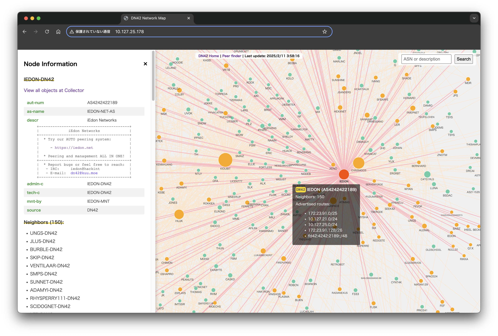

# DN42 Realtime Network Map

This is the repository for map.dn42 service.

GitHub Action has been depolyed to auto generate latest map data from the GRC(Global Route Collector).



## Structure

- `pack.js` for generating final single `index.html` artifact after js files bundled by rollup
- `generator` contains binary data generator, which triggers by GitHub Actions to generate latest `.bin` file from the DN42 GRC dump file
- `public` folder contains those static files will be copied to production folder(for this repository, GitHub Pages)
- `src` folder contains frontend project
- `myip` contains what is my IP service customized for map.dn42

## Build

```bash
bun run build
```

## Credits

- ```isjerryxiao``` for reference of mrt parser
- ```Nixnodes``` for the original DN42 Map. **Totally rewrited.**
- ```0x7f``` for clearnet
- The DN42 GRC service
